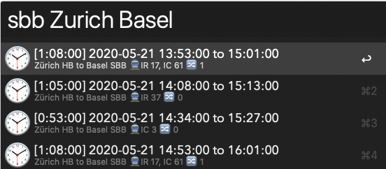

# SBB/CFF/FFS (Swiss Railway) Timetable Workflow
This workflow allows you to show SBB train connections.

# Features
Shows the following information for connections:
- Station names, performs 'best guess' on addresses
- Departure and arrival time
- Duration of travel
- Train types and names
- Number of transfers

Results are sorted from earliest to latest departure.

## Installation & Requirements
For this workflow you need

- Alfred 4 with a [Powerpack](https://www.alfredapp.com/powerpack/) license

To install, download the [latest release](https://github.com/mschmidtkorth/alfred-sbb-msk/releases/latest) and open the `.alfredworkflow` file.

## Usage & Commands
 You can enter cities, station names or addresses.
```text
sbb <station from> <station to>
```



**Examples**
- From main station to main station:
```text
sbb Zurich Basel
```
This will list trains going from *Zurich main station* to *Basel main station*.

- From one station to another station:
```text
sbb Zurich, Belevue Basel
```
This will list trains going from from *Zurich, Bellevueplatz* to *Basel*. Note that the typo 'Belevue' (instead of 'Bellevue') is automatically corrected and results are returned for *Bellevueplatz*.

The workflow will perform a 'best guess' on the station name, e.g. 'Bannhof' is interpreted as 'Bahnhof', or 'Bellevue' is interpreted as 'Zürich, Bellevueplatz'.

Search is powered by search.ch and OpenData.ch.

## How to Contribute
Please see the [contribution guidelines](CONTRIBUTING.md).

## Changelog

- 0.0.1 (2016-07-25)
  - Initial version

## Thanks

- The [OpenData team](http://opendata.ch) for providing their API as well as [SBB](https://data.sbb.ch/) for publishing their timetables.
- [@deanishe](https://github.com/deanishe/) for his wonderful [Alfred-Workflow](https://github.com/deanishe/alfred-workflow) Python library.